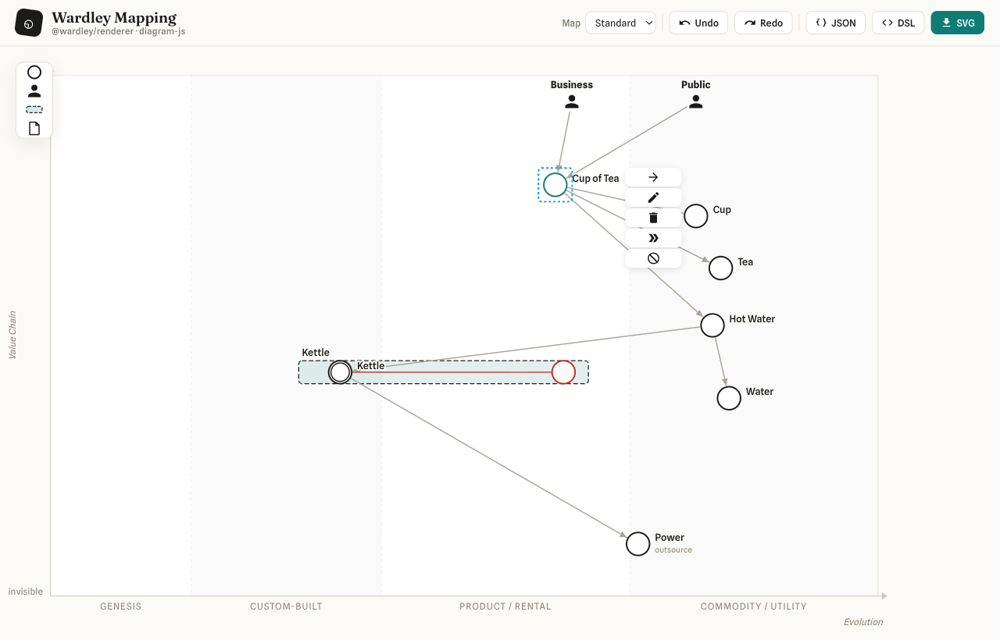
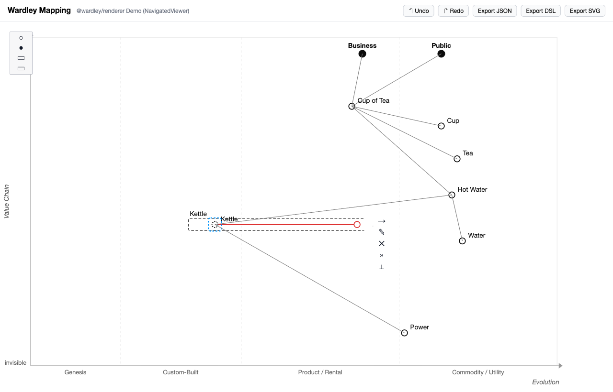
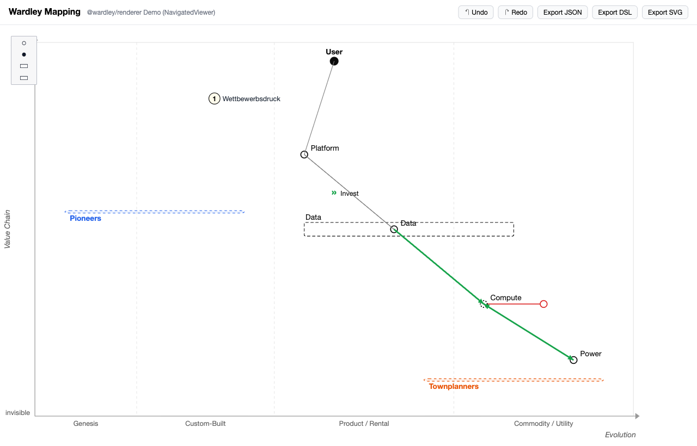

# Wardley Mapping

TypeScript-Bibliothek zum Anzeigen und Editieren von [Wardley Maps](https://learnwardleymapping.com/),
gebaut auf [diagram-js](https://github.com/bpmn-io/diagram-js) (MIT). Die Bibliothek ist die geteilte
Kerntechnologie für zwei Auslieferungsziele: eine **Webapp** und (nachgelagert) eine **VS Code Extension**.

> Architektur orientiert am Schichtenmodell von bpmn-js, jedoch **eigener Code** — `bpmn-js` wird
> wegen seiner Lizenz (Watermark-Pflicht) nie als Dependency aufgenommen. Details: [`docs/KONZEPT.md`](docs/KONZEPT.md).



## Monorepo

pnpm-Workspace mit fix gepinnten Versionen (zentral via `catalog:` in `pnpm-workspace.yaml`).

| Paket                                            | Zweck                                                                                                     | DOM-abhängig? |
| ------------------------------------------------ | --------------------------------------------------------------------------------------------------------- | ------------- |
| [`@wardley/schema-model`](packages/schema-model) | Metamodell (Typen), Zod-Validierung, Stage-Ableitung, Migrationen, deterministische JSON-Serialisierung   | **nein**      |
| [`@wardley/dsl`](packages/dsl)                   | Online-Wardley-Maps-Text-DSL ↔ Modell (keyword-differenzierte Koordinaten, `rawPassthrough`), JSON-Bridge | **nein**      |
| [`@wardley/transforms`](packages/transforms)     | reine `WardleyMap → WardleyMap`-Transformationen (evolve, method, inertia, pipeline) — kein Undo-Stack    | **nein**      |
| [`@wardley/renderer`](packages/renderer)         | diagram-js-Bootstrap, `EvolutionGrid`, `WardleyRenderer`, `Viewer`/`NavigatedViewer`, Import/Export, CSS  | **ja**        |
| [`apps/webapp`](apps/webapp)                     | Vite-Demo-App (rendert die Tea-Shop-Map)                                                                  | **ja**        |

Die DOM-Freiheit der Kernpakete wird doppelt erzwungen: ESLint (`no-restricted-imports` / `no-restricted-globals`)
und `dependency-cruiser` (Modulgraph).

## Status

- **M0–M4 umgesetzt und verifiziert.** 32 Unit-Tests grün; Lint + Typecheck grün; DOM-Boundary
  (dependency-cruiser) verletzungsfrei; voller Build (ESM+CJS+DTS bzw. Vite lib) erfolgreich.
- **M2 Read-only Viewer:** `Viewer`/`NavigatedViewer`, `EvolutionGrid` (einzige Pixel↔normiert-
  Mathematik), `WardleyRenderer`, Import/Export, `saveSVG`.
- **M3 Modeler:** Palette in 3 Gruppen (Bausteine: Komponente/Market/Ecosystem/Anchor/Pipeline/Submap ·
  Strategie & Klima: Pioneers/Settlers/TownPlanners/Accelerator/Deaccelerator · Anmerkungen:
  Notiz/Annotation), **Palette-Icons = WYSIWYG-Vorschau der Canvas-Darstellung**; Drag-to-create.
  Decorators (Market/Ecosystem, Build/Buy/Outsource, **Inertia**) sind keine Elemente, sondern am
  Component über das ⚙-Popup einstellbar.
  Move + `EvolutionConstraintBehavior` (undo-sicher) +
  Stage-Snapping, Connect mit Rules, ContextPad (connect / evolve /
  **⚙ Einstellungen → Popup-Untermenü: Typ (normal·market·ecosystem), Beschaffung
  (build·buy·outsource), Inertia** / edit-label / delete),
  Inline-Label-Editing, **Undo/Redo** (commandStack + Tastatur). Eigener undo-fähiger
  Property-Command-Handler (kein bpmn-js). **Evolve** wird per **Drag** entlang der Evolution-Achse
  gesetzt (Live-Vorschau, ein Undo-Schritt) und ist über das ContextPad wieder **entfernbar**.
  Rahmen (Pipeline/Attitude) sind `isFrame` → nur der Rand ist klickbar, Knoten/User darin bleiben
  direkt anwählbar.
- **M4 Rendering-Fülle:** Flow-Links (gerichtet, bidirektional, mit Wert-Label `+'x'>`), Inertia,
  Annotationen, Attitude-Regionen (Pioneers/Settlers/TownPlanners), Accelerator/Deaccelerator,
  distinkte Submap-Darstellung; DSL-Parser & -Serializer für all diese Typen inkl. Round-Trip.
- **Visuelles Design ("Strategic Blueprint"):** warmes Papier, Tinte, Teal-Akzent; getönte
  Evolution-Bänder, gesperrte Stage-Labels, Label-Halo für Lesbarkeit. Komponenten im
  **BPMN-Event-Stil** (sauberer Kreis; „evolving" = Doppelring wie ein Intermediate-Event),
  **Anchor/User als Icon** (Google Material Icons, Apache-2.0). Verbindungen mit BPMN-Pfeilspitzen,
  an die Knoten-Boundary gecroppt; **Z-Order** Rahmen → Pfeile → Knoten (Knoten im Vordergrund).
  **Material Icons** durchgängig in Toolbar-Buttons und ContextPad (`iconMarkup` aus dem Renderer
  exportiert). Veredelte Webapp-Chrome mit **self-hosteten** Schriften (Fraunces/Spline Sans via
  `@fontsource-variable` — kein Google-Fonts-CDN, DSGVO-konform & offline-fähig).
- **Größenänderung:** Pipelines per Resize-Handles editierbar (Range synchronisiert undo-sicher);
  die gesamte Map ist in der Größe veränderbar (`setMapSize` / Webapp-Auswahl, Knoten reprojizieren
  aus den normierten Koordinaten).
- **Webapp-UI (Excalidraw-Stil):** **leerer Start** mit Empty-State-Karte + „Beispiel anzeigen"
  (lädt die Tea-Shop-Map erst auf Klick); alle Aktionen in einem **Hamburger-Menü** links, nur der
  **Teilen-Button** prominent rechts.
- **Webapp-Sharing & I/O:** Die Map steckt **Base64-kodiert im URL-Hash** (`#m=…`) — der
  **Teilen-Button** kopiert einen vollständigen Link in die Zwischenablage; ein geteilter Link lädt
  die Map sowohl beim Öffnen (echter Seitenload) als auch beim Einfügen in einen offenen Tab
  (`hashchange`) automatisch. **Öffnen per Datei-Dialog oder Drag&Drop** (`.wmap`/`.owm`/`.txt`/
  `.json`/`.svg`/`.png`, auch über dem Empty-State), **Neu / leeren** setzt die Leinwand zurück.
  **PNG- und SVG-Export mit eingebetteter Scene** (Idee aus Excalidraw): die DSL wird ins
  SVG-Wurzelattribut bzw. in einen PNG-`tEXt`-Chunk geschrieben, sodass exportierte Bilder wieder
  per Drag&Drop geöffnet und weiterbearbeitet werden können.
- **Element-Abdeckung:** siehe Tabelle weiter unten.
- Alles im echten Browser (Playwright) verifiziert (DSL → Modell → diagram-js → SVG, Editieren,
  Undo/Redo, Re-Import, Pipeline-/Map-Resize) — siehe `docs/screenshots/`.
- **Noch offen** (Roadmap §14): VS Code Extension (M5), Annotations-Legendenbox-Rendering,
  Pipeline-Block-DSL & `url`-Keyword (aktuell verlustfrei via `rawPassthrough`), Attitude-Resize,
  Submap-Drilldown, Auto-Layout, Copy/Paste, `@wardley/react`-Binding.

### Screenshots

| Editor & Design (aktuell)                    | Modeler (ContextPad)                      | Rendering-Fülle (M4)                 |
| -------------------------------------------- | ----------------------------------------- | ------------------------------------ |
|  |  |  |

### Wardley-Element-Abdeckung

Geprüft gegen [docs.onlinewardleymaps.com](https://docs.onlinewardleymaps.com/docs/category/map-elements)
(alle 13 Element-Seiten, code-verifiziert).

| Element / Syntax                                                   | Modell |   Render    | DSL ↔ |
| ------------------------------------------------------------------ | :----: | :---------: | :---: |
| Component `[visibility, maturity]` (+ Name mit Leerzeichen)        |   ✅   |     ✅      |  ✅   |
| Anchor / User                                                      |   ✅   |     ✅      |  ✅   |
| Dependency `->` (+ `; annotation`)                                 |   ✅   |     ✅      |  ✅   |
| Flow `+>` / `+<>` / `+<` (reverse) / `+'wert'>` (+ `; annotation`) |   ✅   |     ✅      |  ✅   |
| Evolution `evolve` (+ Rename `A->B`, + Methode)                    |   ✅   |    ✅\*     |  ✅   |
| Inertia                                                            |   ✅   |     ✅      |  ✅   |
| Pipeline `[matStart, matEnd]` (resizable)                          |   ✅   |     ✅      |  ✅   |
| Build / Buy / Outsource (Decorator)                                |   ✅   |     ✅      |  ✅   |
| Market / Ecosystem (Decorator + Kombis)                            |   ✅   |     ✅      |  ✅   |
| Accelerator / Deaccelerator                                        |   ✅   |     ✅      |  ✅   |
| PST `pioneers/settlers/townplanners [v,m] width height`            |   ✅   |     ✅      |  ✅   |
| Note                                                               |   ✅   |     ✅      |  ✅   |
| Annotation `n [v,m] text` + `annotations [v,m]`-Position           |   ✅   | ✅ (Marker) |  ✅   |
| Submap `[v,m]`                                                     |   ✅   |     ✅      |  ✅   |
| `title` / `style` / `size` / `evolution` / `y-axis`                |   ✅   |     ✅      |  ✅   |

**Bekannte Lücken** (verlustfrei via `rawPassthrough` erhalten, aber nicht interpretiert/gerendert):

- **Pipeline-Block** `pipeline P { component Sub [maturity] }` (verschachtelte Kinder, die die
  Sichtbarkeit der Pipeline erben) — nur die Annotations-Form `pipeline X [a,b]` wird geparst.
- **Single-Value-Koordinaten** `component X 0.9 (market)` (nur Maturity, Visibility implizit).
- **`url`-Definitionen** `url name [https://…]` + Inline-Referenz `submap X [v,m] url(name)`.
- **`label [dx, dy]`-Offset** wird geparst/serialisiert, aber im Render noch **nicht** angewandt.
- **`evolve` mit kombiniertem Decorator** (`evolve X 0.9 (market, buy)` — `market` wird verworfen);
  Rename/Methode werden am Ziel-Kreis noch nicht beschriftet (`*`).
- **Mehrpunkt-Annotation** `annotation n [[v,m],[v,m]] text` (nur der erste Punkt).
- **Annotations-Legendenbox** (nummerierte Liste an `annotations`-Position) wird noch nicht gezeichnet.

## Befehle

```bash
pnpm install         # Abhängigkeiten (fixe Versionen via catalog:)
pnpm build           # alle Lib-Pakete bauen (tsup / Vite lib mode)
pnpm test            # alle Unit-Tests (vitest)
pnpm run lint        # ESLint + tsc (Typecheck) — wie im husky pre-commit
pnpm run typecheck   # nur Typecheck (Repo-weit, aus den Quellen)
pnpm run depcruise   # DOM-Boundary prüfen
pnpm run dev:webapp  # Demo-Webapp auf http://localhost:5180
```

## Beispiel

```ts
import { NavigatedViewer } from '@wardley/renderer';
import '@wardley/renderer/assets/wardley.css';

const viewer = new NavigatedViewer({ container: document.querySelector('#canvas')! });

await viewer.importDSL(`title Tea Shop
anchor Business [0.95, 0.63]
component Kettle [0.43, 0.35]
evolve Kettle 0.62
Business -> Kettle`);

const map = viewer.exportMap(); // kanonisches JSON-Modell
const dsl = viewer.exportDSL(); // zurück in OWM-Text
const { svg } = await viewer.saveSVG();
```

### Schriften (self-hosted, kein CDN)

Die Library liefert die Schriften **bewusst nicht mit** und lädt **nichts von externen CDNs**
(`wardley.css` enthält nur `font-family`-Deklarationen, keine `@font-face`-Definitionen). Damit
Labels in der vorgesehenen Typografie erscheinen, stellt der **Konsument** die Schrift selbst bereit —
empfohlen self-hosted via [`@fontsource`](https://fontsource.org/) (DSGVO-konform & offline-fähig):

```ts
import '@fontsource-variable/spline-sans'; // Canvas-/Label-Schrift ('Spline Sans Variable')
// optional für die Webapp-Chrome zusätzlich:
import '@fontsource-variable/fraunces/standard.css'; // Display-Schrift ('Fraunces Variable')
```

Ohne bereitgestellte Schrift greift die Fallback-Kette sauber auf System-Sans (`ui-sans-serif`,
`system-ui`, …) zurück — die Darstellung bleibt funktional, nur weniger charaktervoll. Die mitgelieferte
Demo-Webapp (`apps/webapp`) bündelt beide Schriften bereits über `@fontsource-variable`.

## Lizenz

MIT (Lib-Pakete). Drittlizenzen: diagram-js & Abhängigkeiten sind MIT/ISC/Apache-2.0 — siehe
`docs/KONZEPT.md` §3.
