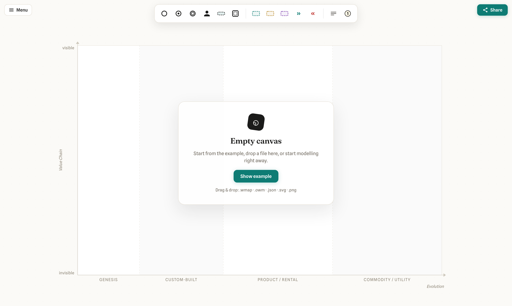

# Wardley Mapping

A TypeScript library for viewing and editing [Wardley Maps](https://learnwardleymapping.com/),
built on [diagram-js](https://github.com/bpmn-io/diagram-js) (MIT). The library is the shared core
for two delivery targets, both included: a **web app** and a **VS Code extension**.

> The architecture follows the layered design of bpmn-js, but is **original code** — `bpmn-js` is
> never taken as a dependency because of its license (watermark requirement). Details:
> [`docs/KONZEPT.md`](docs/KONZEPT.md).


_The editor: a rendered map with the Excalidraw-style floating chrome — tool palette centred at the
top, **Menu** on the left, **Share** on the right. Components are drawn as clean BPMN-style event
circles, users/anchors as icons, and the evolution grid carries the standard stage and axis labels._

## Highlights

- **Full editor on diagram-js (MIT), not bpmn-js.** Palette, context pad, move, connect, resize,
  inline label editing, undo/redo.
- **Model the next component straight from an existing one** — the context pad’s **append** action
  drags out a new (blank) component, **auto-creates the dependency arrow**, shows a live preview of
  both the shape and the arrow, and opens the label editor right away so you can name it.
- **Evolve by drag** along the evolution axis (live preview, single undo step), removable again.
- **Excalidraw-style web app:** empty canvas on start, floating chrome over a full-bleed canvas,
  URL sharing, drag & drop import, and PNG/SVG export with the scene embedded for re-import.
- **Lossless OWM-DSL round-trip**, deterministic JSON model, and a strict DOM-free core.
- **Self-hosted fonts** (no Google Fonts CDN) — offline-capable and GDPR-friendly.

## Monorepo

npm workspaces with exact, pinned versions in each package's `package.json` (`.npmrc` sets `save-exact=true`).

| Package                                                  | Purpose                                                                                                  | DOM-dependent? |
| -------------------------------------------------------- | -------------------------------------------------------------------------------------------------------- | -------------- |
| [`@miragon/wardley-schema-model`](packages/schema-model) | Metamodel (types), Zod validation, stage derivation, migrations, deterministic JSON serialization        | **no**         |
| [`@miragon/wardley-dsl`](packages/dsl)                   | Online-Wardley-Maps text DSL ↔ model (keyword-differentiated coordinates, `rawPassthrough`), JSON bridge | **no**         |
| [`@miragon/wardley-transforms`](packages/transforms)     | pure `WardleyMap → WardleyMap` transforms (evolve, method, inertia, pipeline) — no undo stack            | **no**         |
| [`@miragon/wardley-renderer`](packages/renderer)         | diagram-js bootstrap, `EvolutionGrid`, `WardleyRenderer`, `Viewer`/`NavigatedViewer`, import/export, CSS | **yes**        |
| [`apps/webapp`](apps/webapp)                             | Vite demo app (the editor shown above)                                                                   | **yes**        |
| [`apps/vscode`](apps/vscode)                             | VS Code extension — custom editor for `.wmap`/`.owm` (esbuild-bundled webview + host)                    | **yes**        |

The DOM-freedom of the core packages is enforced twice: ESLint (`no-restricted-imports` /
`no-restricted-globals`) and `dependency-cruiser` (module graph).

## Features

- **Read-only viewer:** `Viewer`/`NavigatedViewer`, `EvolutionGrid` (the single source of pixel↔
  normalized math), `WardleyRenderer`, import/export, `saveSVG`.
- **Modeler:** palette in three groups — building blocks (component / market / ecosystem / anchor /
  pipeline / submap), strategy & climate (pioneers / settlers / town planners / accelerator /
  deaccelerator), notes (note / annotation). **Palette icons are a WYSIWYG preview** of what the
  canvas renders. Drag to create. Decorators (market/ecosystem, build/buy/outsource, **inertia**) are
  not elements but set on a component via the **⚙ settings popup** (type / sourcing / properties).
  Move + `EvolutionConstraintBehavior` (undo-safe) + stage snapping, connect with rules, context pad
  (append / connect / evolve / ⚙ settings / edit label / delete — **including delete on connections**),
  inline label editing, **undo/redo** (command stack + keyboard) via a custom undo-capable property
  command handler. Frames (pipeline/attitude) are `isFrame` → only the border is clickable, so nodes
  inside stay selectable. **Coloured notes**: a note's context pad has a palette action that opens a
  bpmn.io-style **3×3 swatch picker** (8 base colours + "no colour", no full colour picker); the
  colour round-trips losslessly in the DSL as `note … [v,m] (color #hex)`.
- **Rendering coverage:** flow links (directed, bidirectional, value-labelled `+'x'>`), inertia,
  annotations, attitude regions (pioneers/settlers/town planners), accelerator/deaccelerator, a
  distinct submap style; the DSL parser & serializer cover all of these, round-trip included.
- **Visual design ("Strategic Blueprint"):** warm paper, ink, teal accent; tinted evolution bands,
  locked stage labels, label halos for legibility. Components in **BPMN event style** (clean circle;
  "evolving" = double ring like an intermediate event), **anchors/users as icons** (Google Material
  Icons, Apache-2.0). Connections use BPMN arrowheads cropped to the node boundary; **z-order** is
  frames → arrows → nodes (nodes on top).
- **Resizing:** pipelines are editable via resize handles (range kept in sync, undo-safe); the whole
  map can be resized (`setMapSize` / web-app selector, nodes reproject from normalized coordinates).
- **Web-app UI (Excalidraw-style):** no header bar — the chrome floats over a full-bleed canvas. The
  **tool palette** sits centred at the top, **Menu** (open / show example / new / undo / redo /
  export JSON·DSL·SVG·PNG / map size) on the left, **Share** on the right. Start is an **empty
  canvas** with a starter card; the Tea Shop example loads only on **Show example**. After a reload
  the default viewport is fitted so nothing sits behind the floating chrome.
- **Sharing & I/O:** the map is **base64-encoded in the URL hash** (`#m=…`) — **Share** copies a full
  link to the clipboard; a shared link loads the map both on open (real page load) and when pasted
  into an already-open tab (`hashchange`). **Open via file dialog or drag & drop**
  (`.wmap`/`.owm`/`.txt`/`.json`/`.svg`/`.png`, also over the empty state); **New / clear** resets the
  canvas. **PNG and SVG export with the scene embedded** (idea borrowed from Excalidraw): the DSL is
  written into the SVG root attribute resp. a PNG `tEXt` chunk, so exported images can be dropped back
  in and edited further.
- **Quality gates:** the test suite (Vitest, 53 unit tests), ESLint + type-checking, and a
  `dependency-cruiser` check that enforces the DOM-free core boundary — all wired into the build.
- **VS Code extension** (`apps/vscode`): a custom editor for `.wmap`/`.owm` files — the OWM-DSL text
  file stays the source of truth (VS Code owns save / Git / diff), while a webview hosts the full
  diagram-js `Modeler` and mirrors graphical edits back via `WorkspaceEdit` (echo-guarded two-way
  sync). Collapsed menu (top-right): fit · map size · X-axis labels · export SVG/PNG (scene
  embedded); undo/redo is left to VS Code (`Ctrl/Cmd+Z`).
  Two esbuild bundles (host `extension.cjs` + webview), `@miragon/wardley-*` bundled from source. See
  [`apps/vscode/README.md`](apps/vscode/README.md).
- **Open** (roadmap §14): annotations legend box rendering, pipeline-block DSL &
  the `url` keyword (currently preserved losslessly via `rawPassthrough`), attitude resize, submap
  drill-down, auto-layout, copy/paste, a `@miragon/wardley-react` binding.

## Screenshots

| Editor (Tea Shop)                     | Empty canvas (start)                          |
| ------------------------------------- | --------------------------------------------- |
|       |          |
| Rendered map with the floating chrome | Starter card + drag-and-drop / “Show example” |

## Wardley element coverage

Checked against [docs.onlinewardleymaps.com](https://docs.onlinewardleymaps.com/docs/category/map-elements)
(all 13 element pages, code-verified).

| Element / syntax                                                    | Model |   Render    | DSL ↔ |
| ------------------------------------------------------------------- | :---: | :---------: | :---: |
| Component `[visibility, maturity]` (+ names with spaces)            |  ✅   |     ✅      |  ✅   |
| Anchor / user                                                       |  ✅   |     ✅      |  ✅   |
| Dependency `->` (+ `; annotation`)                                  |  ✅   |     ✅      |  ✅   |
| Flow `+>` / `+<>` / `+<` (reverse) / `+'value'>` (+ `; annotation`) |  ✅   |     ✅      |  ✅   |
| Evolution `evolve` (+ rename `A->B`, + method)                      |  ✅   |    ✅\*     |  ✅   |
| Inertia                                                             |  ✅   |     ✅      |  ✅   |
| Pipeline `[matStart, matEnd]` (resizable)                           |  ✅   |     ✅      |  ✅   |
| Build / buy / outsource (decorator)                                 |  ✅   |     ✅      |  ✅   |
| Market / ecosystem (decorator + combos)                             |  ✅   |     ✅      |  ✅   |
| Accelerator / deaccelerator                                         |  ✅   |     ✅      |  ✅   |
| PST `pioneers/settlers/townplanners [v,m] width height`             |  ✅   |     ✅      |  ✅   |
| Note                                                                |  ✅   |     ✅      |  ✅   |
| Annotation `n [v,m] text` + `annotations [v,m]` position            |  ✅   | ✅ (marker) |  ✅   |
| Submap `[v,m]`                                                      |  ✅   |     ✅      |  ✅   |
| `title` / `style` / `size` / `evolution` / `y-axis`                 |  ✅   |     ✅      |  ✅   |

**Known gaps** (preserved losslessly via `rawPassthrough`, but not interpreted/rendered):

- **Pipeline block** `pipeline P { component Sub [maturity] }` (nested children inheriting the
  pipeline’s visibility) — only the annotation form `pipeline X [a,b]` is parsed.
- **Single-value coordinates** `component X 0.9 (market)` (maturity only, visibility implicit).
- **`url` definitions** `url name [https://…]` + inline reference `submap X [v,m] url(name)`.
- **`label [dx, dy]` offset** is parsed/serialized but **not yet applied** on render.
- **`evolve` with a combined decorator** (`evolve X 0.9 (market, buy)` — `market` is dropped);
  rename/method are not yet labelled on the target circle (`*`).
- **Multi-point annotation** `annotation n [[v,m],[v,m]] text` (only the first point).
- **Annotations legend box** (numbered list at the `annotations` position) is not yet drawn.

## Commands

```bash
npm install          # dependencies (exact pinned versions)
npm run build        # build all lib packages (tsup / Vite lib mode)
npm test             # all unit tests (vitest)
npm run lint         # ESLint + tsc (type-check) — same as the husky pre-commit
npm run typecheck    # type-check only (repo-wide, from sources)
npm run depcruise    # check the DOM boundary
npm run dev:webapp   # demo web app at http://localhost:5180
```

## Library usage

```ts
import { NavigatedViewer } from '@miragon/wardley-renderer';
import '@miragon/wardley-renderer/assets/wardley.css';

const viewer = new NavigatedViewer({ container: document.querySelector('#canvas')! });

await viewer.importDSL(`title Tea Shop
anchor Business [0.95, 0.63]
component Kettle [0.43, 0.35]
evolve Kettle 0.62
Business -> Kettle`);

const map = viewer.exportMap(); // canonical JSON model
const dsl = viewer.exportDSL(); // back to OWM text
const { svg } = await viewer.saveSVG();
```

### Fonts (self-hosted, no CDN)

The library **deliberately does not ship fonts** and loads **nothing from external CDNs**
(`wardley.css` only contains `font-family` declarations, no `@font-face` definitions). For labels to
appear in the intended typography, the **consumer** provides the font — recommended self-hosted via
[`@fontsource`](https://fontsource.org/) (GDPR-friendly & offline-capable):

```ts
import '@fontsource-variable/spline-sans'; // canvas/label font ('Spline Sans Variable')
// optional, for the web-app chrome:
import '@fontsource-variable/fraunces/standard.css'; // display font ('Fraunces Variable')
```

Without a provided font the fallback chain degrades cleanly to system sans (`ui-sans-serif`,
`system-ui`, …) — still functional, just less characterful. The bundled demo web app (`apps/webapp`)
already ships both fonts via `@fontsource-variable`.

## License

[MIT](LICENSE). Third-party licenses: diagram-js & dependencies are MIT/ISC/Apache-2.0 — see
[`docs/KONZEPT.md`](docs/KONZEPT.md) §3.
