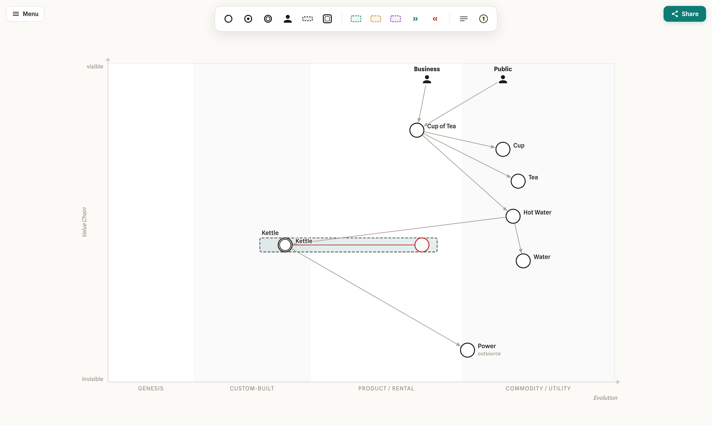

# Wardley Maps

[](LICENSE)
[](https://github.com/Miragon/wardley-maps-modeler/actions/workflows/ci.yml)
[](https://www.npmjs.com/package/@miragon/wardley-renderer)
[](https://marketplace.visualstudio.com/items?itemName=miragon-gmbh.wardley-mapping-modeler)

Create, edit and embed [Wardley Maps](https://learnwardleymapping.com/) — a TypeScript library, a
VS Code extension, and a web app, all built on [diagram-js](https://github.com/bpmn-io/diagram-js).

**[Try the web app →](https://wardley-maps.netlify.app)**



## Install

```bash
npm install @miragon/wardley-renderer
```

```ts
import { NavigatedViewer } from '@miragon/wardley-renderer';
import '@miragon/wardley-renderer/assets/wardley.css';

const viewer = new NavigatedViewer({ container: document.querySelector('#canvas')! });

await viewer.importDSL(`title Tea Shop
anchor Business [0.95, 0.63]
component Kettle [0.43, 0.35]
evolve Kettle 0.62
Business -> Kettle`);

const map = viewer.exportMap(); // canonical JSON model
const dsl = viewer.exportDSL(); // back to OWM text
const { svg } = await viewer.saveSVG();
```

## What you get

- **Embeddable viewer & modeler** on diagram-js — palette, context pad, move/connect/resize, inline
  labels, undo/redo, evolve-by-drag.
- **Lossless [OWM-DSL](https://docs.onlinewardleymaps.com/) round-trip** and a deterministic JSON model.
- **VS Code extension** — a custom editor for `.wmap` / `.owm` files.
- **Web app** — an Excalidraw-style editor with URL sharing and PNG/SVG picture export.
- **Strict DOM-free core** (model, DSL, transforms) — usable in any JavaScript runtime.
- **Self-hosted fonts** — no CDN, offline-capable.

### Editor interactions

| Action                          | How                                                                                                                                                                                              |
| ------------------------------- | ------------------------------------------------------------------------------------------------------------------------------------------------------------------------------------------------ |
| Multi-select (lasso)            | Palette tool, `L`, or `Shift` + drag on the empty canvas                                                                                                                                         |
| Draw lines/shapes               | Palette tool — click point by point; click the last point again (or double-click/`Enter`/`Esc`) to finish, click the start point to close; drag the handles of a selected drawing to move points |
| Quick create at the cursor      | `C` component, `U` user/anchor                                                                                                                                                                   |
| Add to selection                | `Shift` + click on elements                                                                                                                                                                      |
| Copy / paste                    | `Ctrl/Cmd+C`, `Ctrl/Cmd+V` — paste attaches to the cursor; click places, `Esc` cancels                                                                                                           |
| Duplicate (in place)            | `Ctrl/Cmd+D`                                                                                                                                                                                     |
| Nudge selection                 | Arrow keys (`Shift` = coarse)                                                                                                                                                                    |
| Undo / redo                     | `Ctrl/Cmd+Z` / `Ctrl/Cmd+Shift+Z`                                                                                                                                                                |
| Zoom                            | `Ctrl/Cmd` + `+` / `-` / `0` (fit), controls bottom-right                                                                                                                                        |
| Edit label / note               | Double-click (notes: `Cmd/Ctrl+Enter` saves)                                                                                                                                                     |
| Edit link annotation/flow value | Double-click the connection (or pencil in the pad)                                                                                                                                               |
| Evolve                          | Drag from the context pad; drag the red target circle                                                                                                                                            |
| Pipeline membership             | Drop a component into/out of the pipeline box                                                                                                                                                    |

## Packages

| Package                                                  | Description                                              |
| -------------------------------------------------------- | -------------------------------------------------------- |
| [`@miragon/wardley-schema-model`](packages/schema-model) | Metamodel, Zod validation, deterministic JSON (DOM-free) |
| [`@miragon/wardley-dsl`](packages/dsl)                   | OWM text DSL ↔ model, lossless round-trip (DOM-free)     |
| [`@miragon/wardley-transforms`](packages/transforms)     | Pure `WardleyMap → WardleyMap` transforms (DOM-free)     |
| [`@miragon/wardley-renderer`](packages/renderer)         | diagram-js renderer, viewer, import/export               |
| [`apps/webapp`](apps/webapp)                             | Web editor (demo, deployed on Netlify)                   |
| [`apps/vscode`](apps/vscode)                             | VS Code extension for `.wmap` / `.owm`                   |

## Fonts

The renderer ships no fonts and loads nothing from a CDN. The typeface is **Geist** (Miragon
corporate identity); provide it yourself — recommended self-hosted via
[`@fontsource`](https://fontsource.org/) (one variable file covers all weights):

```ts
import '@fontsource-variable/geist/wght.css';
```

Without a font the fallback chain degrades cleanly to system sans.

## Supported Wardley elements

<details>
<summary>Coverage against the OWM element reference</summary>

| Element / syntax                                    | Model | Render | DSL ↔ |
| --------------------------------------------------- | :---: | :----: | :---: |
| Component `[visibility, maturity]`                  |  ✅   |   ✅   |  ✅   |
| Anchor / user                                       |  ✅   |   ✅   |  ✅   |
| Dependency `->`                                     |  ✅   |   ✅   |  ✅   |
| Flow `+>` / `+<>` / `+<` / `+'value'>`              |  ✅   |   ✅   |  ✅   |
| Evolution `evolve`                                  |  ✅   |   ✅   |  ✅   |
| Inertia                                             |  ✅   |   ✅   |  ✅   |
| Pipeline `[matStart, matEnd]` + v2 block `{ … }`    |  ✅   |   ✅   |  ✅   |
| Build / buy / outsource (incl. standalone lines)    |  ✅   |   ✅   |  ✅   |
| Market / ecosystem                                  |  ✅   |   ✅   |  ✅   |
| Accelerator / deaccelerator                         |  ✅   |   ✅   |  ✅   |
| Pioneers / settlers / town planners `[v1,m1,v2,m2]` |  ✅   |   ✅   |  ✅   |
| Note (multi-line, colour)                           |  ✅   |   ✅   |  ✅   |
| Annotation (incl. multi-position)                   |  ✅   |   ✅   |  ✅   |
| Submap + `url` definitions / `url(...)` references  |  ✅   |   ✅   |  ✅   |
| Comments `//` and `/* */` (kept via passthrough)    |  n/a  |  n/a   |  ✅   |
| `label [dx, dy]` offsets                            |  ✅   |   ✅   |  ✅   |
| `title` / `style` / `size` / `evolution` / `y-axis` |  ✅   |   ✅   |  ✅   |

</details>

## Contributing

See [CONTRIBUTING.md](CONTRIBUTING.md) for setup and the inner-loop commands.

## License

[MIT](LICENSE)
