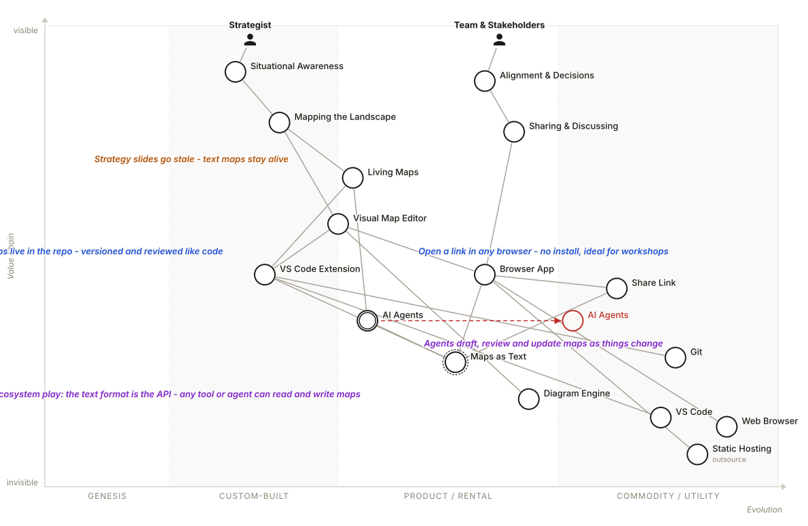

# A Wardley Map of this Wardley Mapping tool

This map explains — in the tool's own language — which needs the tool serves, why it ships
**both** a browser app and a VS Code extension, and why "maps as text" plus AI agents is the
play that matters. It is written for people who own business topics and understand technology,
not for IT architects.

**Open it live:** [in the web app](https://wardley-maps.netlify.app/#mz=dVVda9tKEH3XrzhQCAlExpYdf9wHg28T2kJKCwk3D8EPE2kiLVnvit21XVMK_RH9hf0ll11Jtmwrb7bnzJkzM2fWTjjJeCKTSd7hK5WlUDketZb4-_sPXMGQpDKbUsl44UKoDMJFpNJCGzw4Q45zYR2e-73Z5Br9XjJdNuFHphUu8ODojQstMzb2gBsnyyjVq1IrVg4Pwq3JCa1IYrElw4ptBQ6c4zZ2IUWuVv7TBW45FVZoFbDTaSBuY5uOfCP3-0ae-71JIB4eiyjIePAFboVN19b6Lx5bCR61sfdi46NfqQylxwEyOqL7T9g1SQ_BXSacNh54kzTAUpQsheJuXDJqav6MgBbpAz7qjHH3w7HynXvwcHmE-dforWWDRVmGkuNl9Ks9vy9Y5KxcED4cBj2jZcQbLTfcivZ7k-RkOox7od583mjg8ybTk2FbkMUj_3CHHm7GS1xyqu3OOl5dtfC3gnJDK9yp3M_hud8bjEPXRyv8JCqysNzpUagZhs8MfUyT92o98ct-Lh4e5M-GR-t35ESKz9q6evH9m0A6W-JSr53Va5PyVdRyfTzvdm7UZf143m3dqNv88bzbvVG3_72UDv9G3RcQz89t9z60Zfao80jiedt0UduAta7KOaeR1lbOko62EbXvzYs_PYNTwN7G0fnFHPK7g5-Ei86PstrH3uDdiGNLR4djOs1uXdNpSGnH-FayAkF6gFAgtcNLPaAYSkMo60jKa4iMSeJVG2y1ebOFrh-kcEjTJS5TLbXBh0E24mx6VbGHelJs2HP7dRsuNWJs2PghcAZSGQxvBG85gxRvjLS-tMA8eIe4vo0drBQZW-QaXicjhvOvwsoXto52oFDev67hFJMD4cvoZtif1YT1-DJDr-66VhTErcuMHFeEZOEKoXKLtCCVB9pkdjqBCSeJv9_Ae9c8Eigl7f4JQwgKX7VZkYOw4afF9y-Iw_Sd_0_UBuQFISUFw1TNaWtEo8Q_LaHwYPxO4cZxwoIU9m8VYnDjQRtYqeqcpK-zq7ZVsAnN9cPfzeS8xP8)
· or drag [`tool-landscape.wmap`](tool-landscape.wmap) onto the canvas of any running instance.

## How to read it (30 seconds)

- **Top = what users see and need.** Everything below is what those needs depend on.
- **Left → right = evolution.** Left is novel and hand-made, right is standard and boring —
  in the best sense. Things only ever move right.
- **Dashed red arrow** = expected movement. **Dotted ring** = an ecosystem forms around it.

## The needs this tool serves

Two kinds of users anchor the map:

- The **strategist** (product lead, department head, founder) needs **situational awareness**:
  a picture of the landscape that makes assumptions visible and discussable — that is
  _mapping the landscape_.
- The **team and stakeholders** need **alignment**: looking at the same picture, challenging
  it, and deciding — that is _sharing and discussing_.

Both needs rest on one quiet but decisive capability in the middle of the map: **living maps**.
A map that is drawn once and pasted into a slide deck dies the day after the workshop (the
amber note). A map that lives as a versioned text file next to the everyday work stays current.

## Browser vs. VS Code — one tool, two variants (the pipeline)

On the map the modelling tool is drawn as a **pipeline**: one capability ("Visual Map Editor",
the square anchor) with two concrete variants inside the box — the **VS Code extension**
further left, the **browser app** further right. Both share the same editor engine; they
differ in **who they serve and when**:

|               | **Browser app**                                       | **VS Code extension**                              |
| ------------- | ----------------------------------------------------- | -------------------------------------------------- |
| Best for      | Workshops, meetings, first contact                    | Continuous work, maps alongside code & docs        |
| Entry barrier | None — open a link, no install, no account            | You already live in VS Code                        |
| Sharing       | **Share link** — the whole map travels inside the URL | Git — versioned, diffed and reviewed like any file |
| Map lifetime  | The conversation                                      | The product / the repository                       |

That is why neither replaces the other: the browser app wins **adoption** (zero friction —
anyone in the meeting can open the map), the VS Code extension wins **longevity** (the map is
versioned and reviewed exactly like the work it describes). Like every pipeline, expect more
variants over time — the format underneath stays the same.

## Why text + agents — the ecosystem play

The most important component sits low on the map: **maps as text** (the
[OWM format](https://onlinewardleymaps.com), marked with the dotted ecosystem ring). Every map
is a few lines of readable text — the share link, the `.wmap` file and the VS Code editor all
speak the same format.

Text is the API. Because of it:

- **AI agents** (Copilot, Claude & co. — already in your editor) can draft a first map from a
  description, review an existing one, or update it when the underlying reality changes. The
  red arrow shows where this is heading: agents are racing to the right and become routine.
- Any other tool can produce or consume maps — no exporter, no lock-in, no screenshot graveyard.

And there is a second ecosystem on the map: **VS Code itself** (also marked with the dotted
ring). Millions of developers, their extensions and — increasingly — their AI agents already
live there. Shipping a plugin into that ecosystem is far cheaper than building another app and
puts the maps exactly where the agents are.

This is a classic ecosystem move: standardise the boring part (the format) and let everyone —
humans in two apps, agents, other tools — build on top of it. The value of the tool grows with
every consumer of the format, not just with its own feature list.

## The boring foundation (and why that is good)

Browser, VS Code, Git, static hosting and the diagram engine all sit bottom-right: commodities
and proven products. The tool deliberately builds **nothing novel** there — custom effort goes
only into the parts that differentiate it (the editor experience and the mapping semantics).
That, too, is Wardley doctrine: use appropriate methods per evolution stage.
